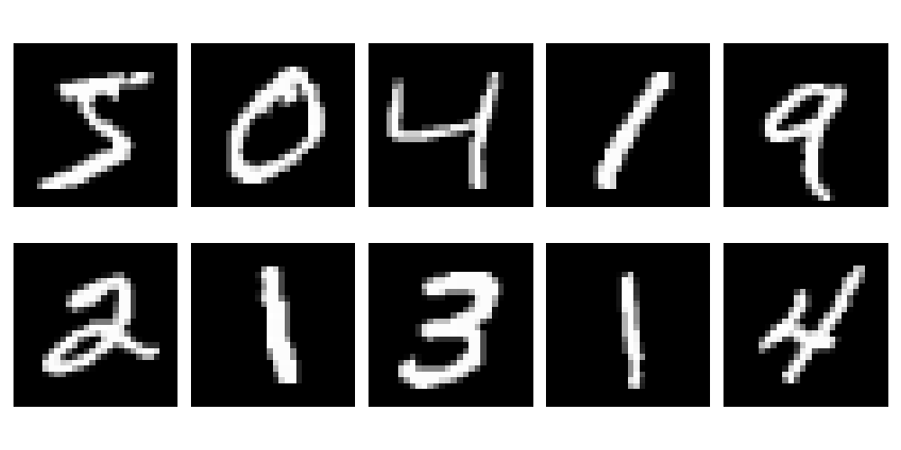
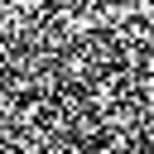
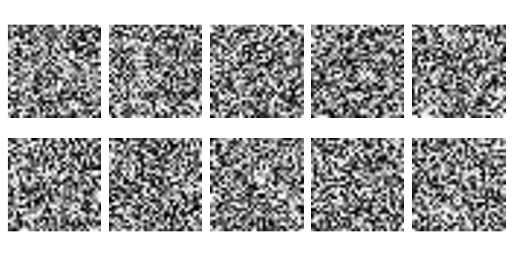
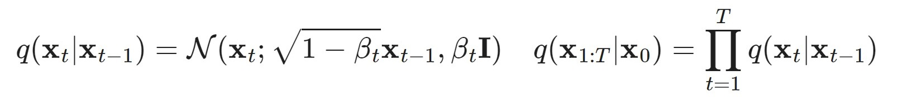
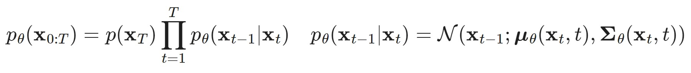
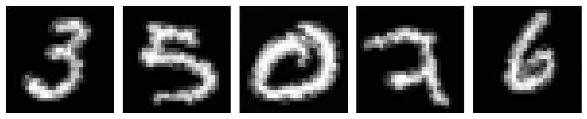

# Applying Denoising Diffusion Model on MNIST dataset

  

    
 
    <em>10 example images from the MNIST dataset</em>

  

  

    

     
    <em>Diffusion model trained on MNIST generating an image</em>
    

  

## Forward Diffusion Process 

 
<em>Images after 200 timesteps applying Gaussian noise</em>

The forward process is a Markov chain of sequentially adding Gaussian noise for $T$ timesteps to the sample image  $x_0$&sim;$q(x)$, resulting in a sequence of noisy samples $x_1, ..., x_T$. The step size is controlled by a variance schedule βt.

## Reverse Diffusion process

Correctly reversing above noising process would lead to a recreation of the true sample image. However, that would require $q(x_{t-1}|x_{t})$ for which we'd need the entire dataset. Thus, we train a model $p$&theta; approximating this conditional probability. Running the reverse diffusion process then looks like this:  

From a sufficiently trained model we can then input random Gaussian noise to generate new images resembling the original dataset. Sample generated images are depicted below representing handwritten digits.  

## Training 

To train the model yourself you can run `train.py` with following arguments `-e [num_epochs] -l [learning_rate] -b [batch_size]`. Training for 5 epochs took around 3 hours on my machine, you can find according checkpoint file in `./models/checkpoint_5ep.pth`.

## References

+ [Paper](https://arxiv.org/pdf/2006.11239.pdf) introducing DDPM

+ Nice [Blog post](https://lilianweng.github.io/posts/2021-07-11-diffusion-models/) explaining DDPM

+ DDPM Python [library](https://huggingface.co/docs/diffusers/v0.17.1/api/schedulers/ddpm)